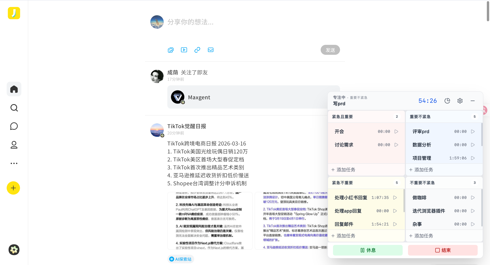
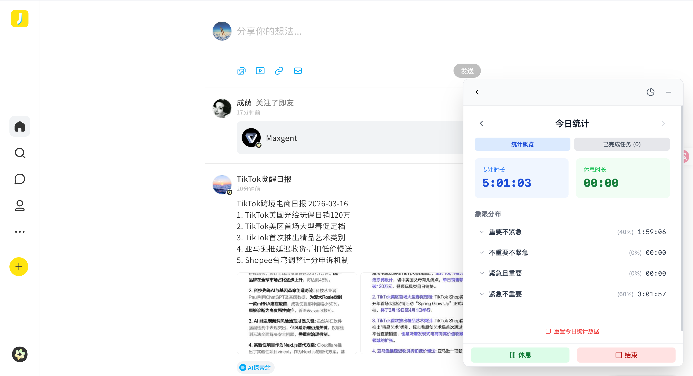

# 全局四象限专注计时浏览器插件 (HabitTrack)

这是一款基于浏览器全局注入的时间管理插件，帮助你在浏览任何网页时都能使用“艾森豪威尔矩阵”来管理任务和时间。

## ✨ 核心功能

- **🌍 全局悬浮展示**：插件界面作为一个悬浮窗嵌入在所有打开的网页中，随时随地触手可及。
- **📊 艾森豪威尔矩阵**：通过“紧急且重要”、“重要不紧急”等四个象限科学分类和管理任务。
- **⏱️ 专注计时器**：内置正向计时功能，精确记录每个任务的投入时间。
- **🔄 实时同步**：所有浏览器标签页状态实时同步，无论切换到哪里，计时和任务状态都保持一致。
- **📈 每日统计**：自动统计每日的专注时长与休息时长，助你复盘时间开销。
- **🛡️ 样式隔离**：采用 Shadow DOM 技术，确保插件样式不受宿主网页影响，始终美观统一。

## 🖼️ 界面预览

### 悬浮窗（展开态）



### 分析总结态



## 技术栈

- React
- TypeScript
- Vite
- Tailwind CSS
- Chrome Extension Manifest V3
- Shadow DOM (用于样式隔离)

## 🚀 安装与使用

1. **克隆仓库**：下载本项目代码到本地。
2. **安装依赖**：
   ```bash
   npm install
   ```
3. **构建项目**：
   ```bash
   npm run build
   ```
4. **加载插件**：
   - 打开 Chrome 浏览器，访问 `chrome://extensions/`。
   - 开启右上角的“开发者模式”。
   - 点击“加载已解压的扩展程序”。
   - 选择项目目录下的 `dist` 文件夹。

## 📝 开发说明

- **`src/background/`**: Service Worker 逻辑，负责状态管理和计时器核心。
- **`src/content/`**: Content Script，负责将 UI 注入到网页中。
- **`src/components/`**: React UI 组件。
- **`src/hooks/`**: 自定义 React Hooks，用于处理状态同步和计时逻辑。

## 📅 版本记录

### v1.0.7
- 🖱️ **优化**：拖拽交互优化，限制窗口顶部越界，避免拖到书签栏上方后无法拖回。
- 🧲 **新增**：窗口底部区域支持拖拽，可从底部快速调整悬浮窗位置。

### v1.0.6
- 🐞 **修复**：修复部分页面因设置了非标准缩放或根字体大小导致插件 UI 异常放大的问题，新增自适应缩放机制。

### v1.0.5
- 📝 **优化**：更新了新手引导内容，增加更详细的任务创建与管理指引。
- 🎨 **优化**：优化进行中任务的状态图标，使用动态旋转的沙漏替代暂停按钮，减少歧义。

### v1.0.4
- ✨ **新增**：自动结束任务功能，可设置每日定时自动停止所有任务，防止忘记关闭。
- ✨ **新增**：重置今日统计数据功能，一键清空当日专注记录。
- 🐞 **修复**：修复跨天时数据未自动刷新的问题，确保日期变更后统计数据实时重置。
- 🐞 **修复**：修复 Service Worker 报错问题（补充 alarms 权限）。
- 🎨 **优化**：最小化悬浮窗样式升级，增强边框和阴影，提升在浅色背景下的可见性。

### v1.0.3
- ✨ **新增**：任务管理增强，支持编辑任务名称和标记任务完成。
- ✨ **新增**：已完成任务回顾视图，可查看当日已完成的任务及耗时。
- 🖱️ **优化**：任务列表交互优化，悬浮显示操作按钮，点击空白处直接开始任务。
- 🔄 **优化**：每日 00:00 自动重置任务累计时间和计时器，新的一天从零开始。
- 📊 **优化**：统计数据支持展开查看各象限下的具体任务耗时。

### v1.0.2
- ✨ **新增**：历史数据统计功能，支持查看过去每一天的专注记录。
- ✨ **新增**：象限分布统计增加百分比展示。
- 🖱️ **优化**：优化悬浮窗交互，透明区域不再遮挡网页点击 (Pointer Events)。
- 📐 **优化**：支持自由调整悬浮窗大小 (Resize)。
- 🔒 **安全**：删除任务时增加二次确认弹窗，防止误操作。
- 🎨 **修复**：修复象限背景色显示不一致的问题。

### v1.0.1
- 🐞 **修复**：计时器逻辑优化，暂停后继续从累计时间开始。
- 🌍 **本地化**：全界面中文化支持。

### v1.0.0
- 🎉 **发布**：首个版本发布，包含基础的四象限任务管理和专注计时功能。

---
*即刻开始，掌控你的时间！*
